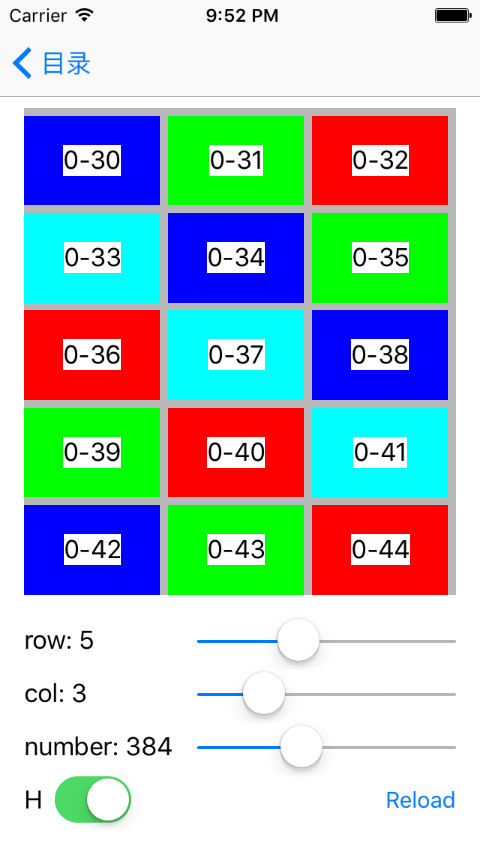

# TICKCollectionViewLayouts-Cocoa
Collection of UICollectionViewLayouts for Cocoa.

## 使用方法

`pod 'TICKCollectionViewLayouts-Cocoa', :tag =>'0.0.1', :git => 'https://github.com/tickCoder/TICKCollectionViewLayouts-Cocoa.git'`

## TICKCollectionViewPagedLayout
可分页的UICollectionViewLayout

- 支持横向、纵向分页
- 支持自定义行、列数
- 支持行间距、列间距、页EdgeInsets
- ItemCell大小不固定，根据其他因素计算

### 截图

